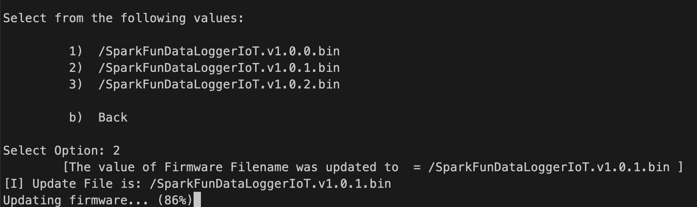

# System Reset and Firmware Update Action - ESP32

> *ESP32*

The System Reset and Firmware Update Action provides the following functionality to the end user:

* Performing a Factory Reset on the device
* Updated the device firmware from a file on an SD Card.

This functionality is accessed via the Serial Console Settings Menu, which is required to use this capability.

When added you a project, the menu entry for this functionality appears as follows:


Once this menu entry is selected, the following menu options are presented:


## Factory Reset

A factory reset will move the boot firmware of the device to the firmware imaged installed at the ***factory*** and erase any on-board stored settings on the device. This is helpful if an update fails, or an update has issues that prevent proper operations.

This option is available on ESP32 devices that contained a ```factory``` firmware partition that contains a bootable firmware image. Consult the specific products production and build system for further details.

When this option is selected, the user is presented a prompt to continue. To launch a factory reset, the value of 1 should be entered.


When a 1 is entered, the system performs the following:

* Set the boot image to the Factory installed firmware
* Erase any settings stored in the on-board flash memory
* Reboot the device


## Firmware Update

This action enables the ability to update the onboard firmware to an image file contained an SD card. This user is presented a list of available firmware images files contained in root directory of the on-board SD card, and updates the board to the selected file.

This option is available on ESP32 devices that contained two update firmware (OTA type) partitions within the on-board device flash memory. Consult the specific products production and build system for further details.

When this option is selected, the user is presented with a Yes/no prompt - entering return or 'y' starts the firmware update process.


When 'Y' is entered, the system will search the root directory of the on-board SD card for available firmware files. The firmware files are selected using the following criteria:

* The file is contained in the root "/" folder of the SD card
* The filename has a ".bin" extension
* The filename starts with a specified name ***prefix***. The prefix is optional and is set by the developer using this action.
  * For example, the DataLogger IoT boards use a prefix value of "SparkFunDataLoggerIoT"

The following is an example of a firmware file list:


Once a file is selected, the system new firmware is read off the SD card and written to the device.



And once updated, the system is rebooted, using the new firmware image.


## Flux Framework Developer Note

To setup this action, perform the following:

### Add the SD card filesystem

```C++
flxSysFirmware.setFileSystem(flxIFileSystem *filesystem);
```

### Add the Serial Settings UX Object

This object is used to display the file selection menu

```C++
flxSysFirmware.setSerialSettings(flxSettingsSerial &serSettings);
```

### And optionally, set a firmware filename prefix value

```C++
flxSysFirmware.setFirmwareFilePrefix(const char * prefix);
```
