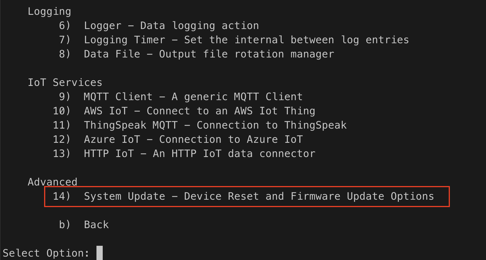
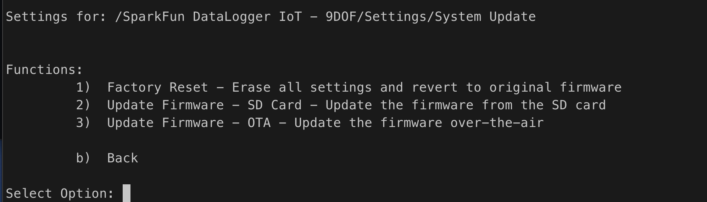
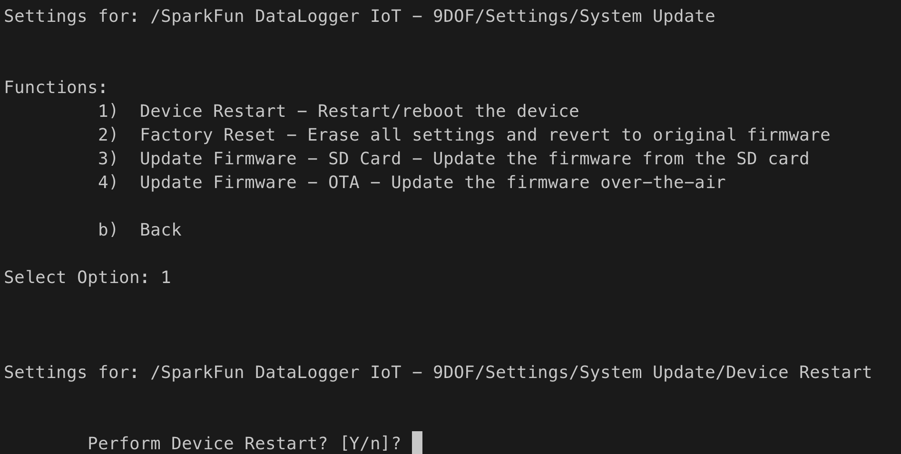
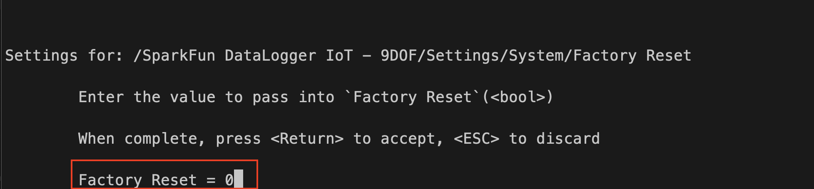
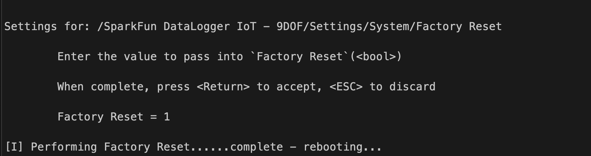
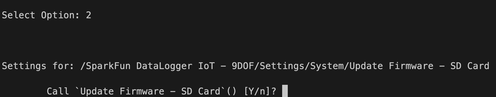
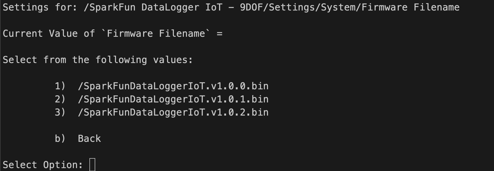
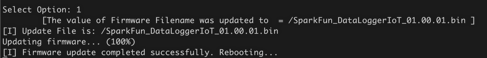
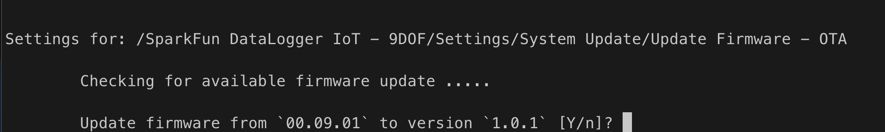
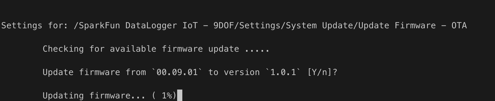

# Firmware Update - ESP32 {#flux-using-esp32-firmware}

> *ESP32*

The System Reset and Firmware Update Action provides the following functionality to the end user:

* Restart the device
* Performing a Factory Reset on the device
* Updated the device firmware from a file on an SD Card.

This functionality is accessed via the Serial Console Settings Menu, which is required to use this capability.

When added you a project, the menu entry for this functionality appears as follows:



Once this menu entry is selected, the following menu options are presented:



## Device Restart

When this option is selected, the device is restarted, using the current firmware and system preferences.

When this option is selected, the user is presented a prompt to continue. To launch a factory reset, the user should enter 'Y'. To abort the update, enter 'n' or press the 'escape' key.



## Factory Reset

A factory reset will move the boot firmware of the device to the firmware imaged installed at the ***factory*** and erase any on-board stored settings on the device. This is helpful if an update fails, or an update has issues that prevent proper operations.

This option is available on ESP32 devices that contained a ```factory``` firmware partition that contains a bootable firmware image. Consult the specific products production and build system for further details.

When this option is selected, the user is presented a prompt to continue. To launch a factory reset, the user should enter 'Y'. To abort the update, enter 'n' or press the 'escape' key.



When a Y is entered, the system performs the following:

* Set the boot image to the Factory installed firmware
* Erase any settings stored in the on-board flash memory
* Reboot the device



## Firmware Update from the SD Card

This action enables the ability to update the onboard firmware to an image file contained an SD card. This user is presented a list of available firmware images files contained in root directory of the on-board SD card, and updates the board to the selected file.

This option is available on ESP32 devices that contained two update firmware (OTA type) partitions within the on-board device flash memory. Consult the specific products production and build system for further details.

When this option is selected, the user is presented with a Yes/no prompt - entering return or 'y' starts the firmware update process.



When 'Y' is entered, the system will search the root directory of the on-board SD card for available firmware files. The firmware files are selected using the following criteria:

* The file is contained in the root "/" folder of the SD card
* The filename has a ".bin" extension
* The filename starts with a specified name ***prefix***. The prefix is optional and is set by the developer using this action.
  * For example, the DataLogger IoT boards use a prefix value of "SparkFun_DataLoggerIoT_"

The following is an example of a firmware file list:



Once a file is selected, the system new firmware is read off the SD card and written to the device.


And once updated, the system is rebooted, using the new firmware image.



## Firmware Update - Over-the-Air (OTA)

This action enables the ability to update the onboard firmware to an image file contained on an update server, which is accessed via the WiFi network the system is connected to. This Over-The-Air  (OTA) capability contacts the systems update server and searches for newer firmware (later version) for the specific board.

This option is available on ESP32 devices that contained two update firmware (OTA type) partitions within the on-board device flash memory. Consult the specific products production and build system for further details.

When this option is selected, the system will contact the update server and search for available upgrade firmware, selecting the latest version available. If a newer version is found, a prompt is presented to confirm the upgrade.



Note - for the upgrade option to occur, a the system must be connected to a network and have access to the firmware OTA server.

Selecting 'Y' (or hitting enter) starts the update operation. As the firmware is downloaded, the percent complete status is updated. If connectivity fails during the download, the operation is halted and the update aborted.



Once the update file is downloaded, it is verified as being the correct file. Once verified, the system is rebooted, loading the new firmware on startup.

## Flux Framework Developer Note

To setup this action, perform the following:

### Add the SD card filesystem

```C++
flxSysFirmware.setFileSystem(flxIFileSystem *filesystem);
```

### Add the Serial Settings UX Object

This object is used to display the file selection menu and prompts

```C++
flxSysFirmware.setSerialSettings(flxSettingsSerial &serSettings);
```

### And optionally, set a firmware filename Prefix

This value is used for SD card firmware file searches

```C++
flxSysFirmware.setFirmwareFilePrefix(const char * prefix);
```

### Set the WiFi Device

The WiFi device is used to validate connectivity when performing OTA.

```C++
flxSysFirmware.setWiFiDevice(flxWiFiESP32 *pWiFi);
```

### Enable OTA Update Capability

The enable OTA update functionality by setting an update manifest URL as follows:

```C++
flxSysFirmware.enableOTAUpdates(const char *otaURL);
```

The URL should be to the firmware manifest file for the OTA system to use.

## OTA Updates

The available firmware is published via a manifest file, which is a JSON formatted file that lists available firmware.

Each firmware entry in this file contains the following fields:

| Field      | Description  |
|------------|------------------|
| ID | The specific name/ID/class for the firmware. This is used to identify firmware to load |
| Version | A string version of the firmware |
| VersionNumber | A numeric version of the firmware |
| Date | A date associated with the firmware |
| Description | A description of the firmware |
| URL | The URL of the firmware binary file |
| Hash | The MD5 hash of the firmware binary file|

All firmware entries are contained in a JSON array, titled 'firmware'.

An example manifest file:

```json
{
  "firmware": [
    {
      "ID": "SFE-DATALOGGER-IOT",
      "Version": "1.0.1",
      "VersionNumber": 010001,
      "Date" : "04-12-2023",
      "Description": "Final production release",
      "URL": "https://raw.githubusercontent.com/gigapod/ota-demo-exp/main/bin/sfeDatalogger_01.00.01.bin",
      "Hash" : "76b9e24a3c812f28f11085e96adea5e9"
    }
  ]
}
```

#### Notes

The `VersionNumber` field is often created by the following formula:

```
  versionNumber = Major_Version * 10000 + Minor_Version * 100 + Point_Version
```

#### MD5 Hash Creation

The following command are used to create an MD5 hash value

MacOS:

```sh
md5 <firmware file>
```

Linux

```
md5sum <firmware file>
```

Windows - using `Power Shell`

```
Get-FileHash <firmware file> -Algorithm MD5
```
