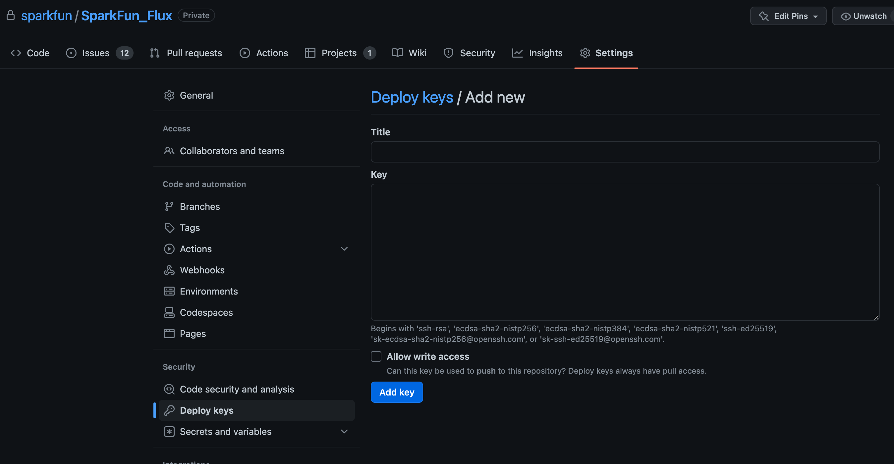
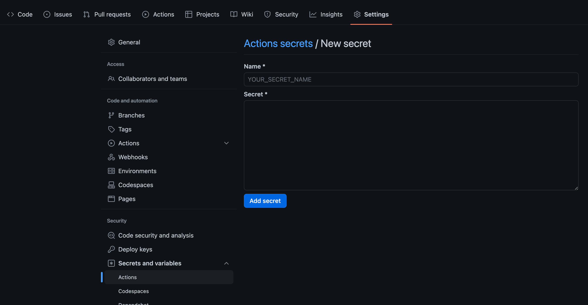

# Building with Flux

This section outline the steps needed to support Flux in an Arduino Build Environment. Both support for Arduino IDE development, as well as automated builds that use the Arduino CLI (GitHub actions). 

Since Flux is private, only available to SparkFun employees and approved partners, the build integration is different from standard Open Source projects. 

## Using Flux within the Arduino IDE

While Flux is structured as an Arduino library, being private, it's not available in the Arduino Library Manager. To use Flux within the Arduino IDE, it is manually installed in the Arduino libraries directory.

Flux is installed by cloning the SparkFun_Flux GitHub repository. To do this, open a terminal on the desired development machine, and change the current directory to your Arduino Libraries install directory. This is normally ```HOME_DIRECTORY/Documents/Arduino/libraries```

From this location, use the following git command to download and install the ***SparkFun_Flux*** library.

```sh
git clone git@github.com:sparkfun/SparkFun_Flux.git
```

Take note, security keys/access to the Flux Private library is required for the clone command to complete successfully.

Once installed, the SparkFun_Flux library is available to other applications/sketches within the Arduino Environment and used like any other Arduino library.

Once you installed Flux locally, you can rapidly install the Arduino library dependencies for Flux using the ```arduino-cli``` as highlighted [later on this page](#install-flux-dependencies).

## Using Flux within a Server/Batch Build Process

To use Flux in another project that is being build using build automation (GitHub Actions), Flux should be added as a git submodule to the project, normally in the root directory of the projects repository. The following command is used:

```sh
git submodule add git@github.com:sparkfun/SparkFun_Flux.git
```

With this structure in place, access to the Flux within a GitHub action is accomplished by using ssh keys. 

The first step is to generate a new key locally - in a shell 

```sh
ssh-keygen -t rsa -b 4096 -C "Access to flux"
```

For this command, don't add a password and you can save the key to a temporary place.

Next add the public part of the key to the Flux repo as a deploy key. In the Flux github repository, open the page:  ```Settings > Deploy Keys``` and click the ***Add deploy key*** button on the page.



Give the key a descriptive name (***my project access key***) and paste the public part of the key into the dialog. Keep the key read-only.

The next step is to add the private part of the key as a ***secret*** in main project (the project using flux) github repository. This is done in ```Settings > Secrets and variables > Actions``` page. On this page, on the **Secrets** tab, select the ***New repository secret*** button. 



In the provided dialog, enter a name for the secret (follow  variable naming methodology) and set the value to the private portion of the generated key. 

## Download the Flux Submodule

Within a github action, the key is used to download the Flux submodule. Once the main repository is checked out, the Flux submodule is checked out with the following action code:

```yaml
    # setup the ssh key used to pull in the Flux submodule source. This was the
      # only way found to make this work when using private models (ssh private key here, public on Flux deploy keys
      - name: Download Flux Submodule
        uses: webfactory/ssh-agent@master
        with:
          ssh-private-key: |
            ${{ secrets.FLUX_PULL_KEY_2 }}
      
      # checkout flux
      - name: Checkout Flux submodule
        run: git submodule update --init --recursive
```

NOTE: In this example, ```FLUX_PULL_KEY_2``` is the name of the Flux key secret within this repository.


Once the Flux submodule is checked out, the application is setup and built using the Arduino Command Line (```arduino-cli```)

## Using Arduino CLI 

### Installation

The Arduino CLI installation is outlined on this [page](https://arduino.github.io/arduino-cli/0.20/installation/).

If working within a github action, the following code will install and setup the arduino-cli:

```yaml
    # Setup Arduino command line - install esp32 and all the libs flux needs
      - name: Arduino - Install and setup the Arduino CLI
        uses: arduino/setup-arduino-cli@v1

      - name: Arduino - Start config file
        run: arduino-cli config init --additional-urls "https://raw.githubusercontent.com/espressif/arduino-esp32/gh-pages/package_esp32_index.json"

      - name: Arduino - Update index
        run: arduino-cli core update-index

    # Install ESP32 
      - name: Arduino - Install ESP32 platform
        run: arduino-cli core install esp32:esp32
```

Note: The above example also installed the ESP32 platform 

### Install Flux Dependencies

The Flux repository includes a script that installs all library dependencies using the ```arduino-cli```. This command, ```install-libs.sh``` is located within the root directory of the Flux repository. 

To run this command within a github Action, the following code is used:

```yaml
    # install the libraries Flux uses
      - name: Install Flux dependant libraries.
        run: ./SparkFun_Flux/install-libs.sh
```

Note: The above command assumes Flux is installed in the root directory of the repository. Adjust the command path to the structure of your repository if needed. 

### Compile and Build

Once all the dependencies are installed, the ```arduino-cli compile``` option is called to build the desired application. To use Flux as a library, the ```--library``` switch is used with the compile call.

The following is an example of building an ESP32 based sketch, which uses the Flux library. 

Note that the location of the Flux library is passed in using the ```--library'`` switch, and that the ***full*** path to the Flux directory is provided. Using a relative path to the Flux library directory causes this command to fail

```yaml
        - name: Compile DataLogger firmware binary
          run: arduino-cli compile --fqbn esp32:esp32:esp32 
            ./sfeDataLoggerIoT/sfeDataLoggerIoT.ino 
            --export-binaries --library `pwd`/SparkFun_Flux     
```

### After the Build

For reference, once the above compile command is completed, the resultant Firmware binary is renamed and uploaded as an Action artifact using the following code:

```yaml
    - name: Rename Library
        run: |
          cd sfeDataLoggerIoT/build/esp32.esp32.esp32/
          mv sfeDataLoggerIoT.ino.bin SparkFun_DataLoggerIoT.bin
          
      - uses: actions/upload-artifact@v3
        with:
          name: SparkFun_DataLoggerIoT.bin
          path: sfeDataLoggerIoT/build/esp32.esp32.esp32/SparkFun_DataLoggerIoT.bin
```