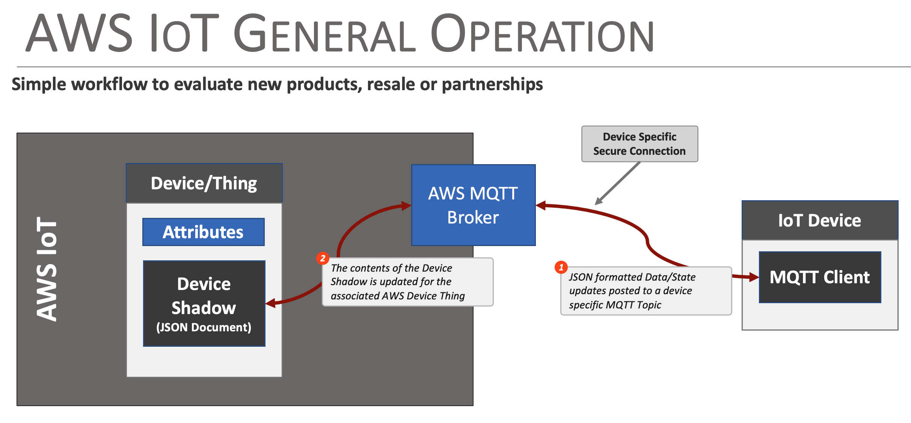

# Creating and Connecting to an AWS IoT Device (Thing)

One of the key features of the Flux Framework is it's simplified access to IoT service providers. This document outlines how an AWS IoT device is used by the Flux framework. 

The following is covered by this document:
* Device (Thing) creation in AWS
* Adding a device to a Flux Framework Device
* Securely connecting the device
* How data is posted from the Flux Framework to the AWS Device via it's Shadow

Currently, the AWS IoT device connection used to post data from the hardware to the IoT AWS Device via the AWS IoT devices **shadow**. Configuration information from AWS IoT to the framework is currently not implemented.

## General Operation

AWS IoT enables connectivity between an IoT / Edge device and the AWS Cloud Platform, implementing secure endpoints and device models within the AWs infrastructure. This infrastructure allows edge devices to post updates, status and state to the AWS infrastructure for analytics, monitoring and reporting. 

In AWS IoT, an virtual representation of an actual device is created and referred to as a *Thing*. The virtual device/Thing is allocated a connection endpoint, security certificates and a device **shadow** - a JSON document used to persist, communicate and manage device state within AWS. 

The actual IoT device communicates with it's AWS representation via a secure MQTT connection, posting JSON document payloads to a set of pre-defined topics. Updates are posted to the AWS IoT device **shadow**, which is then accessed within AWS for further process as defined by the users particular cloud implementation. 



## Creating a Device in AWS IoT
The following discussion outlines the basic steps taken to create a Thing in AWS IoT that the Flux Framework can connect to. 

First step is to log into your AWS account and Select **IoT Core** from the menu of services.


From the IoT Core console page, under the **Manage** section, select **All Devices > Things**  

On the resultant Things Page, select the **Create Things** button.


AWS IoT will then take you through the steps to create a device. Selections made for a demo Thing are:
* Create single thing
* Thing Properties 
    - Enter a name for your thing - for this example ***TestThing23***
    - Device Shadow - select ***Unnamed shadow (classic)***
* Auto-generate a new certificate
* Attach policies to certificate - This is discussed later in this document 
* Select **Create thing**

Upon creation, AWS IoT presents you with a list of downloadable certificates and keys. Some of these are only available at this step. The best option is to download everything presented - three of these are used by the Flux AWS IoT connector.  The following should be downloaded:
* Device Certificate
* Public Key File
* Private Key File
* Root CA certificates - (for example:  Amazon Root CA 1 )

At this point, the new AWS IoT thing is created and listed on the AWS IoT Things Console


### Security Policy
To write to the IoT device, a security policy that enables this is needed, and the policy needs to be assigned to the devices certificate.

To create a Policy, select the ***Manage > Security > Policies*** menu item from the left side menu of the AWS IoT panel. Once on this page, select the **Create policy** button to create a new policy.


When entering the policy, provide a name that fits your need. For this example the name **NewThing23Policy** is used. For the Policy document, you can manually enter the security entires, or enter them as a JSON document. The JSON document used for this example is:

```json
{
  "Version": "2012-10-17",
  "Statement": [
    {
      "Effect": "Allow",
      "Action": "iot:Connect",
      "Resource": "*"
    },
    {
      "Effect": "Allow",
      "Action": "iot:Subscribe",
      "Resource": "*"
    },
    {
      "Effect": "Allow",
      "Action": "iot:Receive",
      "Resource": "*"
    },
    {
      "Effect": "Allow",
      "Action": "iot:Publish",
      "Resource": "*"
    },
    {
      "Effect": "Allow",
      "Action": "iot:GetThingShadow",
      "Resource": "*"
    },
    {
      "Effect": "Allow",
      "Action": "iot:UpdateThingShadow",
      "Resource": "*"
    }
  ]
}
```


Once the policy is created, go back to the IoT Device/Thing created above and associate this policy to the device Certificate.

* Go to your device ***Manage > All devices > Things***
* Select the device - ***TestThing23** for this example
* Select the ***Certificates*** tab
* Select the listed Certificate (it's a very long hex number)
* At the bottom right of the page, select the ***Attach policies*** button and select the Policy created above. 


At this point, AWS IoT is ready for a device to connect and receive data. 