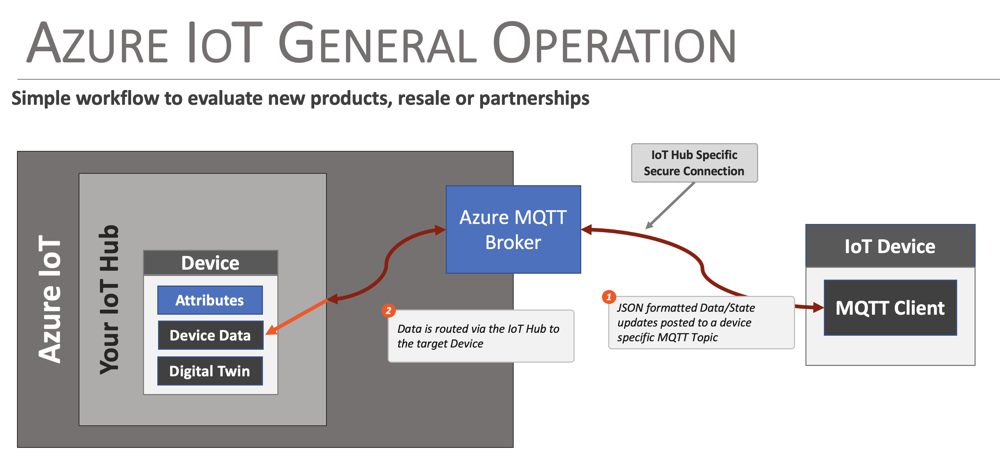

# Creating and Connecting to an Azure IoT Device )

One of the key features of the Flux Framework is it's simplified access to IoT service providers. This document outlines how an Azure IoT device is used by the Flux framework. 

The following is covered by this document:

* Device creation in AWS
* Adding a device to a Flux Framework Device
* Securely connecting the device
* How data is posted from the Flux Framework to the Azure Device

Currently, the Azure IoT device connection used to post data from the hardware to the Azure IoT Device . Configuration information from Azure IoT to the FLux framework is currently not implemented.

## General Operation

Azure IoT enables connectivity between an IoT / Edge device and the Azure Cloud Platform, implementing secure endpoints and device models within the Azure infrastructure. This infrastructure allows edge devices to post updates, status and state to the Azure infrastructure for analytics, monitoring and reporting.

In Azure IoT, an virtual representation of an actual device is created and referred to as a *Device*. The virtual device is allocated a connection endpoint, security certificates and a device **digital twin** - a JSON document used to persist, communicate and manage device state within Azure. Unlike AWS IoT, data from the device isn't posted to the devices digital twin (AWS Shadow), but to the device directly.

The actual IoT device communicates with it's Azure representation via a secure MQTT connection, posting JSON document payloads to a set of pre-defined topics. Updates are posted directly to the Azure device, which is then accessed within Azure for further process as defined by the users particular cloud implementation. 



## Creating a Device in Azure IoT

The following discussion outlines the basic steps taken to create a Device in Azure IoT that the Flux Framework can connect to. 

First step is to log into your Azure account and Select **Internet of Things > IoT Hub** from the menu of services.


### Create an IoT Hub

This IoT Hub page lists all the IoT hubs available for your account. To add a device, you need to create a new IoT Hub.

Follow the Hub Creation workflow - key settings used for a Flux demo device:

* Used the "Free Tier" for testing and development.
* Networking
  * Connectivity - ***Public Access***
  * Minimum TLS Version - ***1.0***

The remaining settings were set at their default values.

## Create a Device

Once the IoT Hub is created, a Device needs to be created within the hub. The device represents the connection to the actual Flux-based device.

To create a device, select the ***Device management > Devices*** from the IoT Hub menu and the select the ***+ Add Device*** menu item


In the create device dialog:

* Enter a name for the device
* Select an Authentication type of ***Symmetric key***
* Auto-generate keys ***enabled***


Once created, the device is listed in the ***Devices*** list of the IoT Hub. Selecting the device gives you the device ID and keys used to communicate with the device. Note, when connecting to the device in Flux, the ***Primary Key*** value is used.


## Adding an Azure IoT Connection in the Flux Framework

To add an Azure IoT device as a destination for the output of a Flux Framework based system, the application being created needs the following:

* Network Connectivity
* A source for JSON output from the device
* A source to store the security certificate needed to connect to the Azure IoT device.

For this example, we show out to connect the output of a data logger in the framework to the Azure IoT device.

First - add an AWS IoT framework to your object

```c++
// include our header
#include <Flux/flxIoTAzure.h>

// later in your code/header - declare an Azure IoT object. 
// In this example, this is a class variable ...

// Azure
    flxIoTAzure _iotAzure;
```

During the setup of the framework - at initialization, the following steps finish the basic setup of the Azure object.

```c++
    // Azure - give the object a name and description
    _iotAzure.setName("Azure IoT", "Connect to an Azure IoT Device");

    // Connect the Azure connection to the Wi-Fi connection being used.
    // Note: The framework will manage connect/disconnect events.
    _iotAzure.setNetwork(&_wifiConnection);

    // certs/keys could be added manually (if they were static arrays in
    // the application code) In this example, we load them in via an
    // attached SD card, so we connect the fileSystem to the Azure object.
    // The Azure object is provided filenames, an automatically loads 
    // the keys/value

    // Add the filesystem to load certs/keys from the SD card
    _iotAzure.setFileSystem(&_theSDCard);

    // Finally, we add the iotAzure device to the JSON format output
    // from our data logger being used in this example. With this
    // connection made, when output is logged, the JSON version of
    // the output is passed to the Azure connection, and then posted
    // to the Azure IoT device.
    _fmtJSON.add(_iotAzure);
```

Once the Flux Azure IoT object is integrated into the application, the specifics for the Azure IoT Thing must be configured. This includes the following:

* Server name/host
* Device Key
* Device ID
* CA Certificate chain

### Server Name/Hostname

This value is hostname of the created IoT Hub and is obtained from the Overview page of the IoT Hub.


### Device ID

The Device ID is obtained from the device detail page. This page is accessible via the Device listing page, which is accessed via the ***Device management > Devices*** menu item. Selected the device of interest (**TestDevice2023** for this example) provides the device ID and Primary Key.


### Device Primary Key 

This is obtained via the Device details page, as outlined in the previous section. Note - you view and copy the key via the icons on the right of the key entry line.

### Root Certificate Authority - CA file

The Certificate Authority file for Azure is downloaded from this page:

https://learn.microsoft.com/en-us/azure/security/fundamentals/azure-ca-details

The file to download is the ***Baltimore CyberTrust Root*** entry in the **Root Certificate Authorities** section of the page.


## Setting Properties

The above property values must be set on the Flux Azure IoT object before use. They can be set in code, like any framework object property, or via a JSON file that is loaded by the system at startup. For the Flux AWS IoT example outlined in this document, the entries in the settings JSON file are as follows:

```json
"Azure IoT": {
    "Enabled": false,
    "Port": 8883,
    "Server": "sparkfun-datalogger-hub.azure-devices.net",
    "MQTT Topic": "",
    "Client Name": "",
    "Buffer Size": 0,
    "Username": "",
    "Password": "",
    "Device Key" : "My-Super-Secret-Device-Key",
    "Device ID"  : "TestDevice2023",
    "CA Cert Filename": "AzureRootCA.pem"
  },
```

## Operation
Once the Flux-based device is configured and running, updates in AWS IoT are listed in the ***Activity*** tab of the devices page. For the test device in this document, this page looks like:


Opening up an update, you can see the data being set to AWS IoT in a JSON format.

