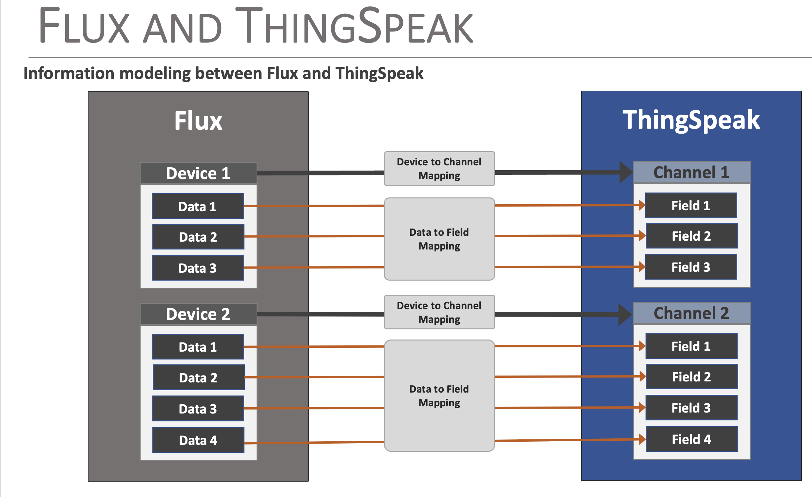

# Creating and Connecting to ThingSpeak

One of the key features of the Flux Framework is it's simplified access to IoT service providers. This document outlines how a ThinkSpeak output is used by the Flux framework

The following is covered by this document:

* Creating a ThingSpeak Channel and MQTT Connection
* Adding ThingSpeak output to a Flux Framework Device
* Securely connecting the ThingSpeak
* How data is posted from the Flux Framework to ThingSpeak

## General Operation

### ThingSpeak Structure

The structure of ThingSpeak is based off of the concept of ***Channels**, with each channel supporting up to eight fields for data specific to the data source. Each channel is named, and has a unique ID associated with it.  One what to think of it is that a Channel is a grouping of associated data values or fields. 

The fields of a channel are enumerated as ***Field1, Field2, ..., Field8**, but each field can be named to simplify data access and understanding.

As data is reported to a ThingSpeak channel, the field values are accessible for further processing or visualization output.

### Flux Framework Data Structure

The Flux Framework is constructed around the concept of ***Devices*** which are often a type of Sensor that can output a set of data values per observation or sample.

### Mapping Flux Device Data to ThingSpeak

The concept of Channels that contain Fields in ThingSpeak is similar to the Devices that contain Data within Flux, and this similarity is the mapping model used by the Flux ThingSpeak connector. Specifically:

* **Devices == Channels**
* **Data == Fields**

During configuration of the Flux ThingSpeak connector, the mapping between the Flux Device and ThingSpeak channel is specified. The data to field mapping is automatically created by Flux following the data reporting order from the specific Flux device driver. 

## Creating a Flux Device to a ThingSpeak Channel

The following discussion outlines the basic steps taken to create a Channel in ThingSpeak and then connect it to a Flux Device. 

First step is to log into your ThingSpeak and create a Channel. Once logged into your ThingSpeak account, select ***Channels > My Channels*** menu item and on the **My Channel** page, select the **New Channel** button.

On the presented channel page, name the channel and fill in the specific channel fields. The fields should map to the data fields reported from the Flux Device being linked to this channel. Order is important, and is determined by looking at output of a device to the serial device (or reviewing the device driver code). 

Once the values are entered, select save. ThingSpeak will now show list of **Channel Stats*, made up of line plots for each field specified for the channel.

Key note - at the top of this page is listed the **Channel ID**. Note this number - it is used to map a Flux Device to a ThingSpeak Channel.

### Setting up ThingSpeak MQTT

The Flux ThingSpeak connector uses MQTT to post data to a channel. From the ThingSpeak menu, select ***Devices > MQTT***, which display a list of your MQTT devices. From this page, select the **Add a new device** button. 

On the presented dialog, enter a name for the MQTT connection and in the **Authorize channels to access**, select the channel created earlier. Note: More channels can be added later. Once you select a channel, click the **Add Channel** button. The selected Channel is then listed in the **Authorized Channel** table. Ensure that the Allow Publish and Allow Subscribe attributes are enabled for the added channel.

**NOTE**

>When the MQTT device is created, a set of credentials (Client ID, Username and Password) is provided. **Copy or download** these values, since the password in not accessible after this step.

Channel Authorization.

At this point, the ThingSpeak Channel is setup for access by the Flux ThingSpeak connector.
